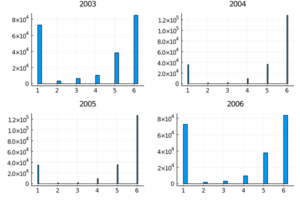

# ASEC FILESTAT adjustment

The CPS ASEC variable FILESTAT reports the federal income tax filing status. Its values are imputed by the Census Bureau's Tax Model and provide six different tax filing status categories:

| Code   | Label           
| :----: |-------------------------------------|
| 1      | Joint, both less than 65            |
| 2      | Joint, one less than 65 and one 65+ |
| 3      | Joint, both 65+                     |
| 4      | Head of household                   |
| 5      | Single                              |
| 6      | Nonfiler                            |

As the panels below illustrate, the share of nonfilers appears to be much larger in 2004 and 2005. The reverse applies to the share of joint filers below 65 while the shares of head of household and single filers seem comparable across years.

Based on these distribution of FILESTAT values, I formed the following hypothesis: In years other than 2004 and 2005, the imputation procedure generating FILESTAT values assigned persons who filed jointly the same category. In 2004 and 2005, however, it assigned one of them the joint filer status and nonfiler status to the other. 

My adjustment algorithm corrects the discrepancies on the basis of this hypothesis.
